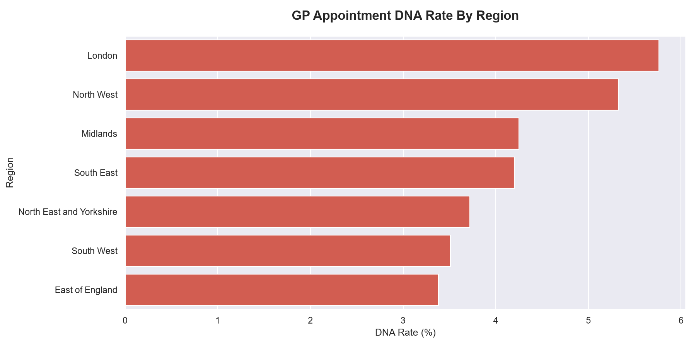
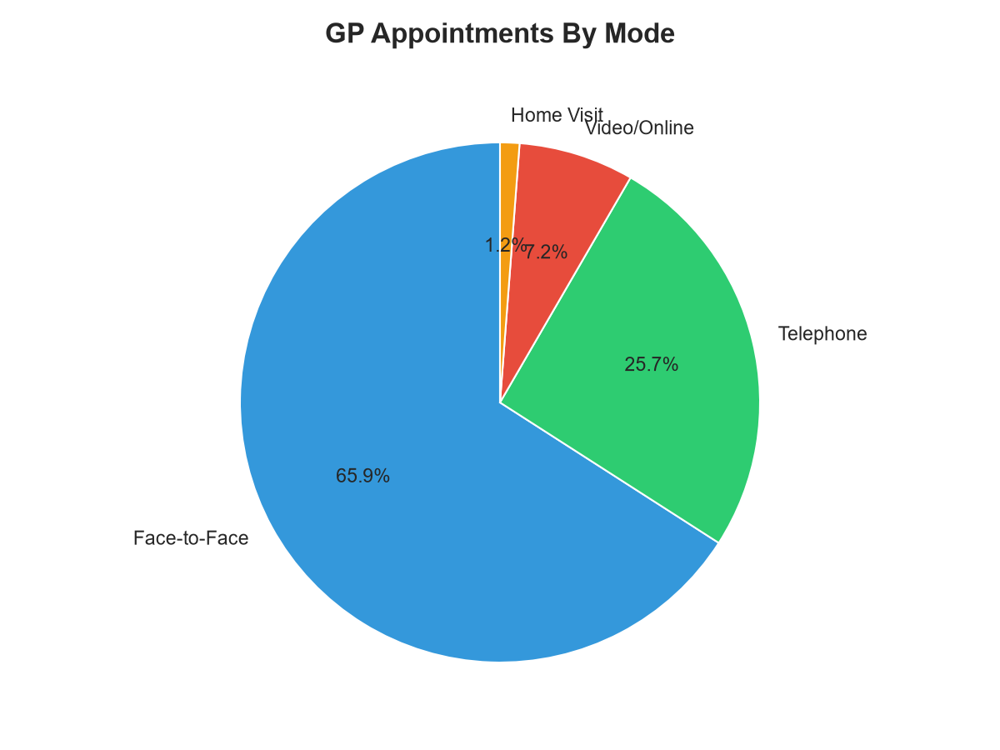
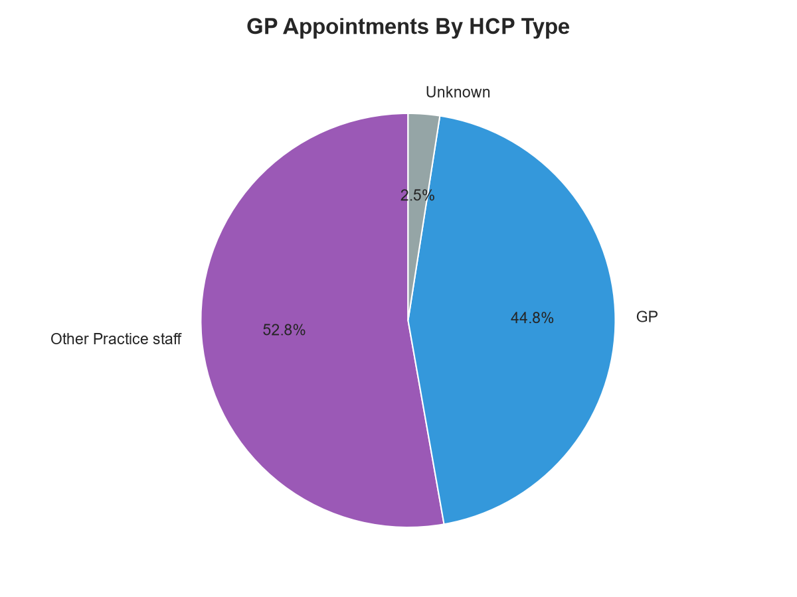
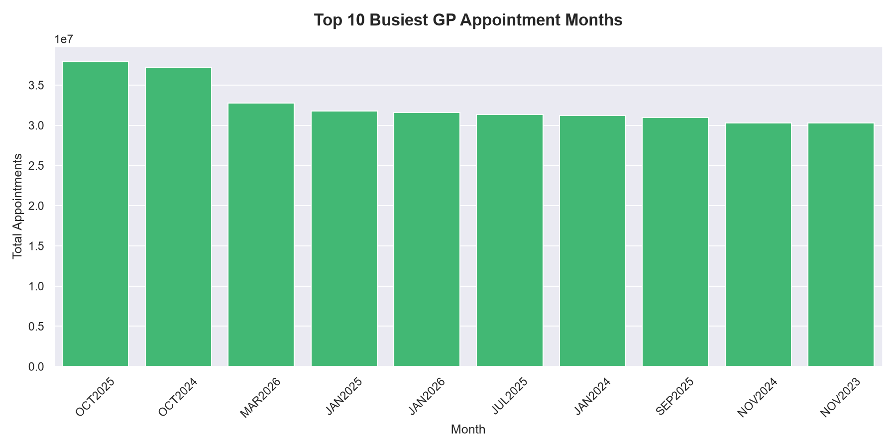
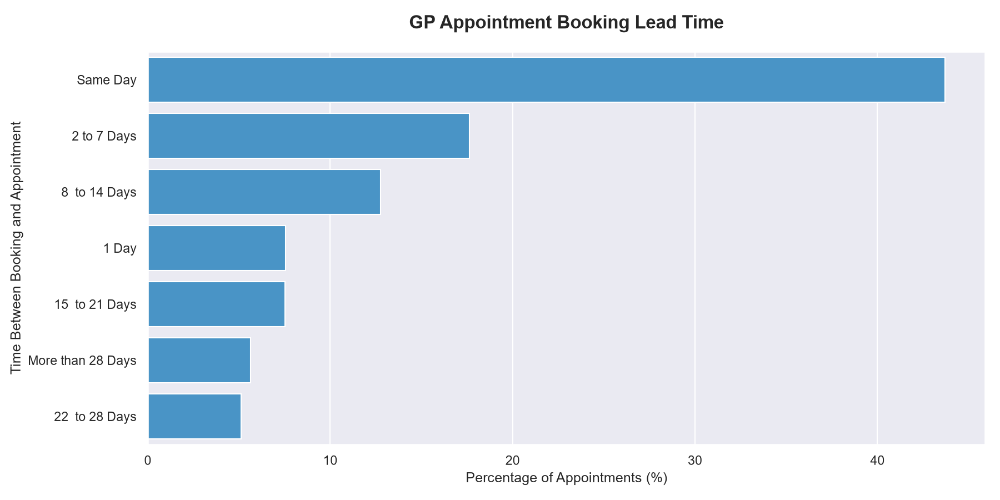

# NHS GP Appointments Analysis
### Python Portfolio Project — Azeem Malik

---

## Project Overview
This project analyses over 929 million real GP 
appointments across England from November 2023 
to April 2026 using data published by NHS Digital.

As a digital transformation professional with 
10+ years NHS experience, I combined domain 
expertise with Python and SQL data skills to 
answer five key operational questions facing 
NHS primary care today.

---

## Tools Used
- Python (pandas, matplotlib, seaborn)
- NHS Digital Open Data
- VS Code

---

## Dataset
Source: NHS Digital — Appointments in General 
Practice, April 2026
Coverage: England, all NHS regions
Date Range: November 2023 to April 2026
Records: 719,915 rows across 7 regions

---

## Business Questions Answered

### Question 1 — DNA Rate By Region
Which regions have the highest missed 
appointment rates?

**Key Finding:** London has the highest DNA 
rate at 5.76% — nearly 8 million missed 
appointments. East of England has the lowest 
at 3.38%. Higher DNA rates in London likely 
reflect the more transient population, 
deprivation levels, and same day booking 
patterns in urban areas.

---

### Question 2 — Appointment Mode Breakdown
How are patients being seen across 
different appointment types?

**Key Finding:** Face to face appointments 
still dominate at 65.9% but telephone 
appointments now account for 25.7% — 
a permanent shift from pre-COVID levels 
where telephone appointments were 
approximately 15% of all contacts.

---

### Question 3 — HCP Type Analysis
Who is delivering GP appointments?

**Key Finding:** Other Practice Staff now 
handle 52.8% of appointments — more than 
GPs at 44.8%. This reflects the success 
of the NHS ARRS scheme which funded 
additional clinical roles to reduce 
GP workload and free up GP time 
for complex cases.

---

### Question 4 — Busiest Appointment Months
When is demand highest in general practice?

**Key Finding:** October is consistently 
the busiest month, appearing in the top 
two spots across consecutive years. 
January also features prominently — 
both periods align with winter pressure 
season and post-holiday backlogs 
requiring additional capacity planning.

---

### Question 5 — Booking Lead Time
How far in advance are appointments booked?

**Key Finding:** 43.71% of all appointments 
are booked same day — over 406 million 
appointments in just 5 years. This reflects 
the well-documented 8am rush phenomenon 
in general practice where patients compete 
for same day slots due to lack of 
advance availability.

---

## Charts

### DNA Rate By Region

### Appointments By Mode

### Appointments By HCP Type

### Busiest Months

### Booking Lead Time

---

## How To Run This Project

1. Download NHS Regional appointment data from:
   digital.nhs.uk
2. Place CSV files in the same folder
3. Install dependencies:
   pip install pandas matplotlib seaborn
4. Run the analysis:
   python nhs_analysis.py

---

## About Me
Digital transformation professional with 10+ 
years NHS experience across Epic, Oracle Health, 
Meditech Expanse, Nervecentre and Nuance Dragon. 
Currently building data analytics skills in 
Python and SQL with a focus on healthcare 
and public sector data.